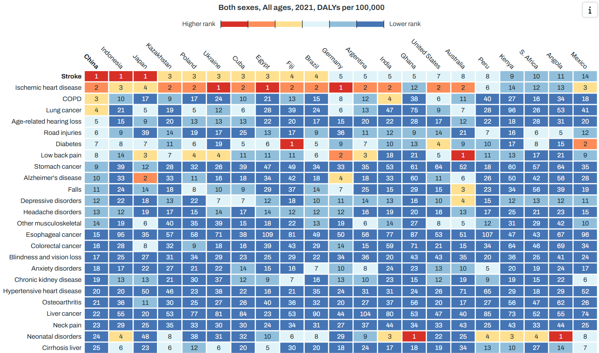

[LINK TO FIGURE ON GBD COMPARE](http://ihmeuw.org/705y)

# Heatmap
Shows the relative ranking of cause by location. Code shows how additional data is available through GBD Compare (Cause rankings) that are unavailabe directly through the GBD Results Tool. You may calculate your own rankings if desired.
## GBD Color Palette
This code inputs includes the same colors that are used for rankings and convergent scales in GBD Compare.
